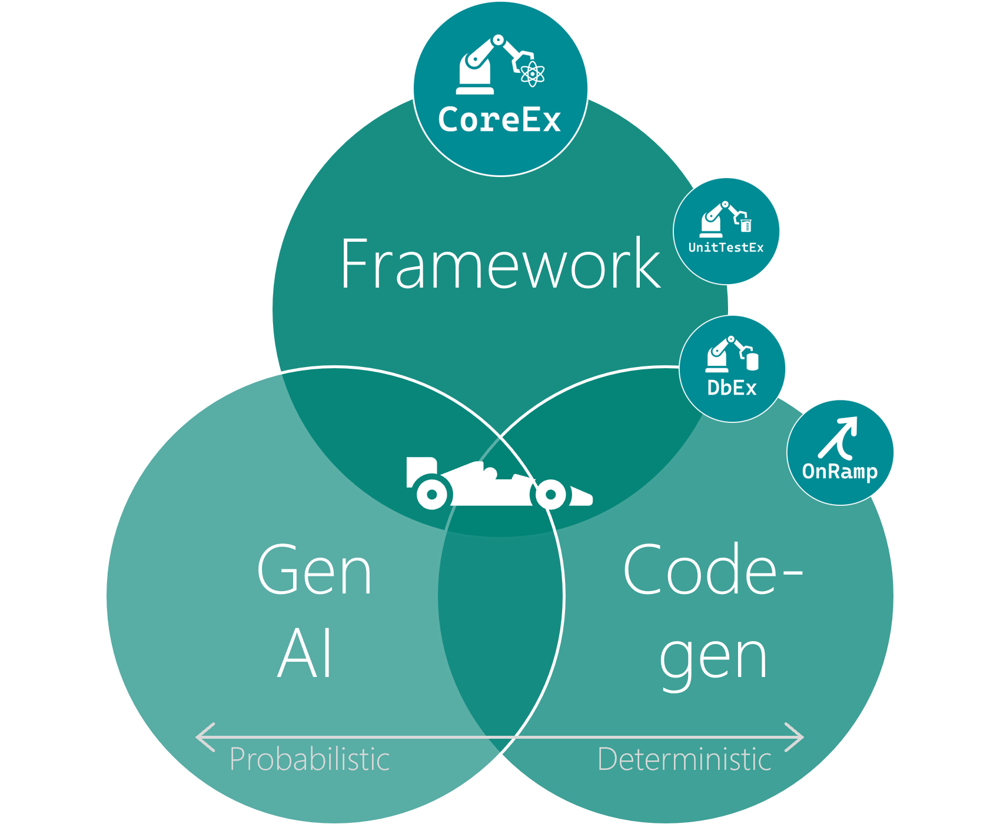

 

## Introduction

_CoreEx_ is a modular .NET framework for building enterprise back-end services. It addresses the recurring concerns that .NET leaves to each team to solve independently: shaping business rule failures into consistent HTTP responses, publishing and subscribing to domain events, implementing reference data with caching and validity, enforcing validation with structured error messages, and wiring data access across ADO.NET and Entity Framework Core with a shared unit-of-work model.

The solution is composed of focused, independently consumable packages — `CoreEx` provides the shared runtime primitives, and each additional package (`CoreEx.AspNetCore`, `CoreEx.Events`, `CoreEx.Database`, `CoreEx.Validation`, etc.) adds a specific capability layer. Teams adopt only what they need.

## Motivation

- **Standardize** the scenarios .NET leaves open — there is no built-in standard for mapping a `NotFoundException` to HTTP 404, expressing a concurrency conflict as a `ProblemDetails` response, or publishing a domain event transactionally alongside a database commit. _CoreEx_ provides consistent, opinionated implementations of these patterns so every service in an organization behaves the same way.
- **Simplify** development by eliminating the boilerplate that accumulates around every API endpoint and data operation — execution context scoping, idempotency key handling, paged query translation, outbox relay, ETag management, change-log stamping — freeing teams to focus on business logic rather than infrastructure ceremony.
- **Enable flexibility** through opt-in modularity and composability — each package is an independent add-on, _CoreEx_ does not mandate an architectural style, and its abstractions (`IMapper`, `IUnitOfWork`, `IHybridCache`, `IEventPublisher`) are designed to be replaced or extended without disrupting the rest of the solution.

## Better Together

The greatest developer velocity gains come not from any single capability, but from the intersection of all three:

- **Framework** _(**CoreEx**, UnitTestEx, DbEx)_ — encapsulates proven patterns and complexity into tested, shared components. Every team inherits a consistent, production-hardened baseline rather than rebuilding infrastructure from scratch, maximising reuse and freeing engineers to focus on differentiated business logic.
- **Code-generation** _(CoreEx.Generator, CoreEx.CodeGen, DbEx / OnRamp)_ — automates the translation of intent into implementation. Roslyn source generation, dev-time scaffolding, and database/entity layer generation combine to produce repetitive layers predictably and consistently every time — deterministic by design — eliminating manual error and accelerating the path from design to working code.
- **Gen AI / Copilot** — accelerates the development of the unique business value that only your organisation can deliver. AI assistance — probabilistic and context-aware — augments engineers during coding, testing, and review, compressing the feedback loop between idea and production-ready solution.

Where all three converge, the compound effect is multiplicative: the framework constrains the solution space so AI suggestions land in the right patterns; code-generation handles the deterministic heavy lifting so AI can focus on novel logic; and AI in turn accelerates how quickly teams adopt, extend, and validate both.

## Key Capabilities

Here is a high-level overview of some of the key capabilities provided by _CoreEx_:

**Core runtime**
- 🎯 **Semantic Exceptions** — Typed exception hierarchy (`NotFoundException`, `ValidationException`, `BusinessException`, `ConcurrencyException`, and more) with automatic HTTP status-code mapping and `ProblemDetails` serialization.
- 🔐 **Execution Context** — Thread-bound (async-local) request context carrying user identity, tenant, and timestamp; ASP.NET Core middleware integrates it directly into the request pipeline.
- 📦 **Entity & DDD Patterns** — Composable entity interfaces for identifiers (`IIdentifier<T>`), ETags (`IETag`), change logs (`IChangeLog`), composite keys, change tracking, aggregate roots with integration-event support, and persistence-state mutation guards.
- 🚂 **Railway-Oriented Programming** — `Result` and `Result<T>` monadic types for composable, exception-free error flows with full `async`/`await` support and short-circuit chaining.
- 💉 **Dependency Injection** — `[ScopedService]`, `[TransientService]`, and `[SingletonService]` attributes with `AddDynamicServicesUsing<T>` for convention-based registration without manual wiring.
- 🗺️ **Mapping & Conversion** — Bi-directional `IMapper<TSource, TDestination>` contracts, `ValueConverter<TSource, TDestination>` for EF Core and custom property mapping, and extension-based mapper helpers.
- 🔄 **JSON Extensions** — Merge-patch (`application/merge-patch+json`) support, property-include/exclude filtering, custom `JsonConverter` types, and `JsonSerializer` configuration helpers.

**Web / API**
- 🌐 **ASP.NET Core Integration** — `WebApi` execution helpers for MVC and Minimal API, `ExecutionContext` scoping middleware, idempotency key handling (`[IdempotencyKey]`), and exception-to-`ProblemDetails` translation with consistent error response shaping.
- 📋 **OpenAPI / NSwag** — `IOperationProcessor` that reads CoreEx MVC attributes (`[Paging]`, `[Query]`, `[Accepts]`, `[IdempotencyKey]`, `[ProducesNotFoundProblem]`) and injects the corresponding parameters, request bodies, and response entries into the generated OpenAPI specification.

**Data**
- ✅ **Validation Framework** — Fluent, property-centric validator with composable rules, conditional clauses, async predicates, `RuleSet` grouping, base-validator include, FluentValidation interop bridge, and deep `ValidationException` / `ProblemDetails` integration.
- 📊 **Data Access & OData-style Querying** — `QueryArgsConfig`, `QueryFilterParser`, and `QueryOrderByParser` for safe, explicitly-configured `$filter` and `$orderby` LINQ translation; query arguments, paging, partitioning, logical deletion, and `IUnitOfWork` transactional orchestration.
- 🗄️ **Database & ORM** — `IDatabase` / `DatabaseCommand` ADO.NET abstraction with multi-result-set support, transactional outbox relay infrastructure, SQL Server and PostgreSQL implementations with OpenTelemetry metrics, and an Entity Framework Core integration layer with typed CRUD operations and `ValueConverter` bridges.
- 📚 **Reference Data** — Typed `ReferenceData<TSelf>` / `ReferenceData<TId, TSelf>` base classes, thread-safe `Id`- and `Code`-indexed collections, hybrid-cache-backed orchestrator with per-type semaphore loading, contextual date-validity checking, and a code-serialization collection for wire-compatible reference-data properties.
- ⚡ **Hybrid Caching** — `IHybridCache` abstraction with `FusionHybridCache` (ZiggyCreatures FusionCache) as the recommended implementation, providing L1/L2 hybrid storage and backplane-based cache invalidation.

**Messaging**
- 📨 **Event Publishing & Subscribing** — `EventData` ↔ CloudEvents formatting, a two-phase queue-then-publish pipeline, and configurable subscriber dispatch with per-subscriber structured error handling and dead-letter support.
- 🚌 **Azure Service Bus** — `ServiceBusPublisher` implementing `IEventPublisher`, subscriber bases wired to `EventSubscriberBase`, and receiver hosts with built-in resiliency, OpenTelemetry metrics, and session support.

**Tooling**
- 🏗️ **Reference Data Code Generation** — Development-time `CoreEx.CodeGen` tooling that scaffolds the complete reference-data layer (contract, controller, service, repository interface, repository, and mapper) from a single schema-validated `ref-data.yaml` configuration file.
- 🧪 **Testing Toolkit** — `CoreEx.UnitTesting` provides fluent value expectations, event-capture and outbox assertions (SQL Server, PostgreSQL, Azure Service Bus), JSON/YAML seed-data loading with placeholder substitution, and UnitTestEx bridge extensions covering every CoreEx subsystem.

## Patterns in Practice

The capabilities above come to life in the [Contoso reference samples](./samples/README.md), which implement a fully working multi-domain service topology. The samples are the primary demonstration of _why_ CoreEx exists — they show how the packages compose into a coherent, production-shaped architecture.

The [Pattern Catalog](./samples/docs/patterns.md) is the best entry point: it indexes every architectural and design pattern demonstrated across the samples, grouped by concern, each linked to the layer documentation that shows it in code.

| Group | Patterns demonstrated |
|---|---|
| 🏛️ **Architecture** | Domain microservices, event-driven architecture (async-primary, sync-selective), hexagonal architecture, eventual consistency |
| 🌐 **API** | Thin-controller HTTP endpoints, idempotency keys |
| ⚙️ **Application** | CQRS, service orchestration, unit of work, composable validators, reusable policies |
| 📋 **Contracts** | Technology-agnostic DTOs shared across API and messaging, first-class reference data |
| 🏛️ **DDD** | Aggregates, entities, value objects with enforced invariants |
| 🗄️ **Infrastructure** | Repository abstraction, explicit mappers, persistence models, anti-corruption adapters, typed HTTP clients |
| 📨 **Messaging** | CloudEvent publishing, transactional outbox, outbox relay, event-driven replication, subscriber dispatch |
| 🛠️ **Tooling** | Schema-driven code generation, database lifecycle management via migration scripts |
| 🧪 **Testing** | Intra-domain host tests against real infrastructure, inter-domain mocking, unit tests, local Aspire orchestration for E2E validation |

→ **[View the full pattern catalog](./samples/docs/patterns.md)**

## Version 4 (preview)

This is a **major** version release; a re-imagine / re-invention of the existing capabilities to enable a more modern, flexible and maintainable codebase.
- This release contains **significant breaking changes** - there is **no** upgrade path from the previous `v3.x` versions; however, the core capabilities and patterns remain largely consistent.
- A number of capabilities have been removed as they were not widely used, considered legacy/obsolete, or there are better alternatives available.
- Not all existing capabilities have been re-implemented in this release; the intention is to (re-)add further capabilities in future releases as required.

Version 4 is currently in **preview**; the packages are published with a `-preview` suffix and may contain future breaking changes. The packages in their current state can be used for Production-based solutions. Feedback is very welcome to help shape the final release.

The Copilot and Claude [AI](#ai) integrations should be considered experimental and subject to change/improvements.

## Status

The build status is  with the NuGet package status as follows, including links to the underlying source code and documentation:

Project/Package | Description | Source | Status
-|-|-|-
`CoreEx` | The foundational `CoreEx` package providing the core runtime primitives, patterns, and abstractions used across all other CoreEx libraries and consuming services. | [Link](./src/CoreEx) | 
`CoreEx.AspNetCore` | Provides the ASP.NET Core integration layer for CoreEx: the `WebApi` execution helper (MVC and Minimal API variants), middleware for `ExecutionContext` scoping and exception-to-ProblemDetails translation, idempotency key handling, health check configuration, and OpenAPI/NSwag extensions. | [Link](./src/CoreEx.AspNetCore) | 
`CoreEx.AspNetCore.NSwag` | Provides the NSwag `IOperationProcessor` integration that reads CoreEx MVC attributes (`[Paging]`, `[Query]`, `[Accepts]`, `[IdempotencyKey]`, `[ProducesNotFoundProblem]`) and injects the corresponding parameters, request bodies, and response entries into the generated OpenAPI specification. | [Link](./src/CoreEx.AspNetCore.NSwag) | 
`CoreEx.Azure.Messaging.ServiceBus` | Provides Azure Service Bus integration for CoreEx: a `ServiceBusPublisher` implementing `IEventPublisher`, subscriber bases wired to `EventSubscriberBase`, and receiver hosts with built-in resiliency, metrics, and session support. | [Link](./src/CoreEx.Azure.Messaging.ServiceBus) | 
`CoreEx.Caching.FusionCache` | Provides a `FusionHybridCache` implementation of `IHybridCache` backed by the ZiggyCreatures FusionCache library, bridging CoreEx caching contracts to FusionCache's L1/L2 hybrid and backplane capabilities. | [Link](./src/CoreEx.Caching.FusionCache) | 
`CoreEx.Data` | Provides the `IUnitOfWork` transactional orchestration contract, `DataResult` mutation outcome types, data model base classes, and the `QueryArgsConfig` / `QueryFilterParser` / `QueryOrderByParser` pipeline for safe, explicitly-configured OData-style `$filter` and `$orderby` LINQ query translation. | [Link](./src/CoreEx.Data) | 
`CoreEx.Database` | Provides the `IDatabase` / `Database` ADO.NET abstraction, `DatabaseCommand` fluent query builder, `DatabaseRecord` row reader, multi-result-set support, convention-based column mapping, database wildcard translation, typed mapper contracts, and the transactional outbox relay infrastructure for publishing events from a relational database. | [Link](./src/CoreEx.Database) | 
`CoreEx.Database.Postgres` | Provides the PostgreSQL (Npgsql) implementation of `IDatabase`: `PostgresDatabase`, `PostgresUnitOfWork`, outbox relay, Postgres-specific parameter extensions, and OpenTelemetry metrics for outbox operations. | [Link](./src/CoreEx.Database.Postgres) | 
`CoreEx.Database.SqlServer` | Provides the SQL Server (`Microsoft.Data.SqlClient`) implementation of `IDatabase`: `SqlServerDatabase`, `SqlServerUnitOfWork`, session-context stamping, outbox relay, SQL Server-specific parameter extensions, and OpenTelemetry metrics for outbox operations. | [Link](./src/CoreEx.Database.SqlServer) | 
`CoreEx.DomainDriven` | Provides the foundational Domain-Driven Design (DDD) building blocks for CoreEx: typed entities, aggregate roots with integration-event support, persistence-state tracking, and mutation-guard helpers. | [Link](./src/CoreEx.DomainDriven) | 
`CoreEx.EntityFrameworkCore` | Provides the Entity Framework Core integration layer: `EfDb<TDbContext>` as the CoreEx-EF bridge, `EfDbModel<TModel>` and `EfDbMappedModel<TValue, TModel, TMapper>` for typed CRUD + query operations, `EfDbExtensions` for paged `IQueryable<T>` mapping helpers, `EfDbInvoker` for OpenTelemetry tracing, and EF `ValueConverter` bridges for CoreEx converter types. | [Link](./src/CoreEx.EntityFrameworkCore) | 
`CoreEx.Events` | Provides the CoreEx event publishing and subscribing infrastructure: `EventData` ↔ CloudEvents formatting, a two-phase queue-then-publish pipeline, and configurable subscriber dispatch with structured error handling. | [Link](./src/CoreEx.Events) | 
`CoreEx.RefData` | Provides the CoreEx reference data framework: typed base classes for reference data items and collections, a hybrid-cache-backed orchestrator, contextual date-validity checking, and a code-serialization collection. | [Link](./src/CoreEx.RefData) | 
`CoreEx.Validation` | Provides a fluent, property-centric validation framework for .NET classes: composable rules, conditional clauses, strongly-typed error messages, and deep integration with the CoreEx execution and exception model. | [Link](./src/CoreEx.Validation) | 
-- | -- | -- | --
`CoreEx.CodeGen` | Provides the CoreEx development-time code-generation tooling: a deterministic, schema-driven pipeline that scaffolds the full reference-data implementation — contract, controller, service, repository interface, repository, and mapper — from a single YAML configuration file. | [Link](./src/CoreEx.CodeGen) | 
`CoreEx.UnitTesting` | Provides the complete CoreEx unit- and integration-testing toolkit: fluent expectations, event-capture assertions, JSON seed-data loading, and convenience extensions that bridge UnitTestEx with every major CoreEx subsystem. | [Link](./src/CoreEx.UnitTesting) | 

The included [change log](CHANGELOG.md) details all key changes per published version.

## Samples

The repository includes [Contoso reference samples](./samples/README.md) that implement a fully working multi-domain service topology — Products, Shopping, and Orders — each with an API host, an Outbox Relay host, and an Event Subscriber host.

| Resource | Description |
|---|---|
| [samples/README.md](./samples/README.md) | Runnable topology, prerequisites, infrastructure setup, and getting-started commands |
| [Pattern Catalog](./samples/docs/patterns.md) | Every architectural and design pattern demonstrated, grouped by concern with links to layer docs |
| [Layer Guide](./samples/docs/layers.md) | Business and host layer overview with the full dependency diagram |
| [Tooling Guide](./samples/docs/tooling.md) | Code generation and database lifecycle tooling |
| [Testing Guide](./samples/docs/testing.md) | Unit, intra-domain, inter-domain, and E2E testing strategy |
| [Aspire & E2E Guide](./samples/docs/aspire.md) | Local orchestration and cross-domain end-to-end validation |

## AI

The repository includes an AI workflow set in [`.github/`](./.github/) that gives GitHub Copilot and Claude Code authoritative knowledge of CoreEx patterns, conventions, and architecture — no need to explain CoreEx to the tool each time. The artefacts can also be copied into a consuming project.

**Agent** — `coreex-expert` provides architecture guidance, pattern recommendations, and design reviews aligned to the sample implementations. See the [agent README](./.github/agents/README.md) for the resolution flowchart and local doc cache design.

**Commands and templates** — type `/` in chat to invoke skills and prompts. Use `dotnet new` in a terminal for deterministic scaffolding.

| Command | What it does | Claude Code | GitHub Copilot Chat |
|---------|-------------|-------------|---------------------|
| [Expert guidance](./.github/agents/README.md) | Architecture, pattern, and design advice | `@coreex-expert` | Agent mode → **CoreEx Expert** |
| [CoreEx.Template](./src/CoreEx.Template/README.md) | Deterministic solution and host scaffolding via `dotnet new coreex*` templates | `dotnet new install CoreEx.Template` then `dotnet new coreex...` | Run the same `dotnet new` commands in the terminal |
| [`/coreex-docs-sync`](./.github/skills/coreex-docs-sync/README.md) | Cache CoreEx docs and per-package AI guides locally | `/coreex-docs-sync` | `#file:.github/skills/coreex-docs-sync/SKILL.md` |
| [`/acquire-codebase-knowledge`](./.github/skills/acquire-codebase-knowledge/README.md) | Map and document an existing codebase | `/acquire-codebase-knowledge` | `#file:.github/skills/acquire-codebase-knowledge/SKILL.md` |
| [`/aspire`](./.github/skills/aspire/README.md) | Orchestrate Aspire apps locally (start, stop, logs) | `/aspire` | `#file:.github/skills/aspire/SKILL.md` |
| `/init` · `/setup` | Initialize or configure a solution | `/init` · `/setup` | `/init` · `/setup` |

**Instructions** — 10 scoped instruction files are injected automatically when editing matching file types (contracts, services, repositories, controllers, tests, etc.). No action required.

**Domain templates** — 77 ready-made templates covering all layers, both SQL Server and PostgreSQL, and optional features (CodeGen, Domain, Outbox Relay, Subscribe, ROP). See the [domain templates README](./.github/templates/domain/README.md).

→ **[Full AI workflow overview](./.github/README.md)**

## License

_CoreEx_ is open source under the [MIT license](./LICENCE) and is free for commercial use.

## Contributing

One of the easiest ways to contribute is to participate in discussions on GitHub issues. You can also contribute by submitting pull requests (PR) with code changes. Contributions are welcome. See information on [contributing](./CONTRIBUTING.md), as well as our [code of conduct](https://avanade.github.io/code-of-conduct/).

## Security

See our [security disclosure](./SECURITY.md) policy.

## Who is Avanade?

[Avanade](https://www.avanade.com) is the leading provider of innovative digital and cloud services, business solutions and design-led experiences on the Microsoft ecosystem, and the power behind the Accenture Microsoft Business Group.
