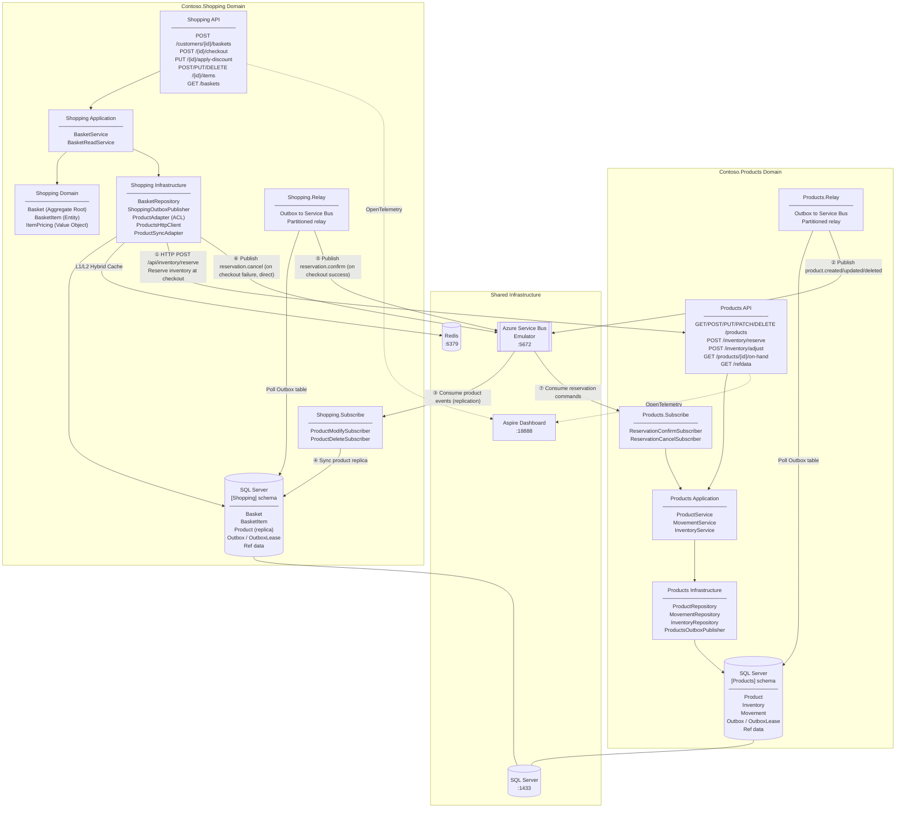

# Contoso Samples

The `samples` folder contains reference implementations of three domain microservices built with CoreEx: **Products**, **Shopping**, and **Orders** (Orders workflow is work in progress).

Each domain is an independently deployable unit with an API host, an Outbox Relay host, and an Event Subscriber host, backed by an applicable data repository, and connected to other domains via synchronous HTTP and asynchronous messaging over Azure Service Bus.

> **Documentation** — detailed guides for layers, patterns, tooling, and testing are in [`samples/docs`](docs/).
>
> | Guide | Description |
> |---|---|
> | [Layers](docs/layers.md) | Business and host layer overview with dependency diagram |
> | [Patterns](docs/patterns.md) | Catalog of architectural patterns implemented across the samples |
> | [Tooling](docs/tooling.md) | Code generation (`*.CodeGen`) and database management (`*.Database`) |
> | [Testing](docs/testing.md) | Unit, intra-domain, inter-domain, and E2E testing strategy |
> | [Aspire & E2E](docs/aspire.md) | Local orchestration and cross-domain end-to-end validation |

## Architecture

The domains communicate via synchronous HTTP and asynchronous messaging over Azure Service Bus.



### Inter-Domain Communication

| Flow | Direction | Mechanism |
|---|---|---|
| ① Inventory reservation | Shopping → Products | Synchronous HTTP — `ProductAdapter` calls `POST /api/inventory/reserve` at basket checkout. |
| ② – ④ Product replication | Products → Shopping | Products Outbox → Relay → Service Bus → `Shopping.Subscribe` keeps a local product replica in sync. |
| ⑤ – ⑦ Reservation commands | Shopping → Products | On checkout success the outbox enqueues `reservation.confirm`; on failure Shopping publishes `reservation.cancel` directly to Service Bus (the transaction has already rolled back). |

See [Patterns](docs/patterns.md) for the full catalog of architectural patterns demonstrated across the samples.

## Project Layout

| Path | Purpose |
|---|---|
| `src/Contoso.Products.*` | Products domain — Contracts, Application, Infrastructure, API, Relay, Subscribe, CodeGen, Database |
| `src/Contoso.Shopping.*` | Shopping domain — same layer split plus Domain aggregate |
| `src/Contoso.Orders.*` | Orders domain (work in progress) |
| `aspire/Contoso.Aspire` | Aspire AppHost — orchestrates all hosts for local development and E2E validation |
| `tests/Contoso.*.Test.*` | Unit, API, Relay, and Subscribe test projects per domain |
| `tests/Contoso.E2E.Runner` | Interactive E2E and load-simulation console runner |

See [Layers](docs/layers.md) for the full layer-by-layer breakdown of each project's responsibilities.

## Prerequisites

- .NET SDK targeting `net8.0`, `net9.0`, and `net10.0` (a current .NET 10 SDK is sufficient).
- A container runtime (Docker or Podman).
- Aspire CLI:

  ```bash
  # Windows (PowerShell)
  iwr -useb https://aspire.dev/install.ps1 | iex

  # Linux/macOS
  curl -sSL https://aspire.dev/install.sh | bash
  ```

  Verify with `aspire --version`. See [aspire.dev/get-started/install-cli](https://aspire.dev/get-started/install-cli/) for details.

## Getting Started

### 1 — Start Infrastructure

```bash
podman compose -f docker-compose.yml up -d
```

This starts the required data store(s), Redis, and the Azure Service Bus emulator.

### 2 — Initialize Databases

Run migrations and seed reference data for each domain:

```bash
dotnet run --project samples/src/Contoso.Products.Database -- All
dotnet run --project samples/src/Contoso.Shopping.Database -- All
dotnet run --project samples/src/Contoso.Orders.Database   -- All
```

> The E2E runner's **Database Migration and Base Data Refresh** option can also apply pending migrations across all domains without restarting hosts. See [Aspire & E2E](docs/aspire.md) for details.

See [Tooling](docs/tooling.md) for the full list of database commands and what each does.

### 3 — Start All Hosts

```bash
aspire run
```

This starts every domain API, Outbox Relay, and Subscribe host as a single distributed application and opens the Aspire Dashboard for centralized logs, traces, and metrics. See [Aspire & E2E](docs/aspire.md) for a full walkthrough.

### 4 — Run Tests

```bash
dotnet test samples/tests/Contoso.Products.Test.Unit
dotnet test samples/tests/Contoso.Products.Test.Api
dotnet test samples/tests/Contoso.Products.Test.Relay
dotnet test samples/tests/Contoso.Products.Test.Subscribe
dotnet test samples/tests/Contoso.Shopping.Test.Api
```

The required infrastructure (data store, Redis, Service Bus emulator) must be running for API, Relay, and Subscribe tests.

See [Testing](docs/testing.md) for an explanation of test taxonomy, intra-domain vs inter-domain boundaries, data seeding, mock patterns, and the fluent assertion model.

### 5 — Run E2E Scenarios

```bash
dotnet run --project samples/tests/Contoso.E2E.Runner
```

The runner drives real HTTP calls across all domains, supports one-shot scenarios and parallel load simulation, and requires all hosts to be running (step 3 above).

See [Aspire & E2E](docs/aspire.md) for the interactive menu reference, configuration, and recommended first-run order.

## Stop Infrastructure

```bash
podman compose -f docker-compose.yml down
```

## Troubleshooting

### Outbox Relay Does Not Pick Up Messages

Symptom:

- API operations succeed but published events are not processed by the relay/subscriber as expected.

Likely cause:

- Local machine UTC time is skewed relative to message timestamps (clock drift where local UTC is ahead of expected outbox processing windows).

What to try:

1. Verify and correct system date/time and time zone settings.
2. Restart the outbox relay host (or restart all sample hosts from Aspire).
3. If the behavior persists, restart the machine to force a clean time sync.

### Dependencies Not Healthy

Symptom:

- Hosts fail on startup or repeatedly log dependency connectivity errors.

What to try:

1. Ensure infrastructure containers are running: `podman compose -f docker-compose.yml up -d`.
2. Check container health: `docker ps` or `podman ps`.
3. Restart containers: `podman compose -f docker-compose.yml down && podman compose -f docker-compose.yml up -d`.

### Database Errors On Startup

Symptom:

- API or relay hosts fail with database or schema-related errors.

What to try:

1. Re-run migrations and data seeding for the affected domain (step 2 above).
2. Confirm the data store container(s) are healthy before restarting hosts.
